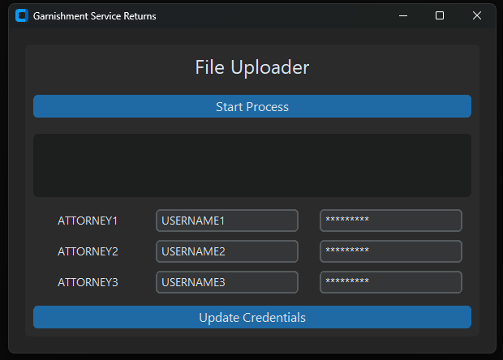

# Automated E-Filing Script

This repository contains a Python script that automates the e-filing process for garnishment service returns using Selenium and customtkinter. The script logs into a court portal, uploads documents, updates a status spreadsheet, and provides an intuitive GUI for easy interaction, including managing attorney credentials.

## Features

- **Automated Login:** Logs into the court portal using attorney credentials.
- **File Uploading and Form Submission:** Automates the process of uploading garnishment service return documents and submitting forms on the court portal.
- **Status Updates:** Updates the status of filings in an Excel workbook.
- **Attorney Credential Management:** Allows for easy updates to attorney credentials via the GUI.
- **CustomTkinter-based GUI:** Provides an easy-to-use interface for starting the e-filing process and managing credentials.

## Prerequisites

- Python 3.x
- Google Chrome browser
- ChromeDriver
- Required Python packages (specified in `requirements.txt`)

## Setup

1. **Clone the repository:**

    ```sh
    git clone https://github.com/yourusername/your-repo-name.git
    cd your-repo-name
    ```

2. **Install dependencies:**

    ```sh
    pip install -r requirements.txt
    ```

3. **Download and setup ChromeDriver:**

    - Download ChromeDriver from [here](https://sites.google.com/chromium.org/driver/downloads).
    - Place the `chromedriver` executable in a known directory and update the `executable_path` in the script.

4. **Update credentials:**

    - In the script, replace the placeholder credentials with actual usernames and passwords for the attorneys.

5. **Set file paths:**

    - Update the file paths in the script (`wb_path`, `file_path`) to match your directory structure.

## Usage

1. **Run the script:**

    ```sh
    python E-filing_Automation.py
    ```

2. **Interact with the GUI:**

    - Click the "Start Process" button to begin the e-filing process.
    - The log output will be displayed in the GUI.
  
## Screenshots


  
## License

This project is licensed under the MIT License. See the [LICENSE](LICENSE) file for more details.

